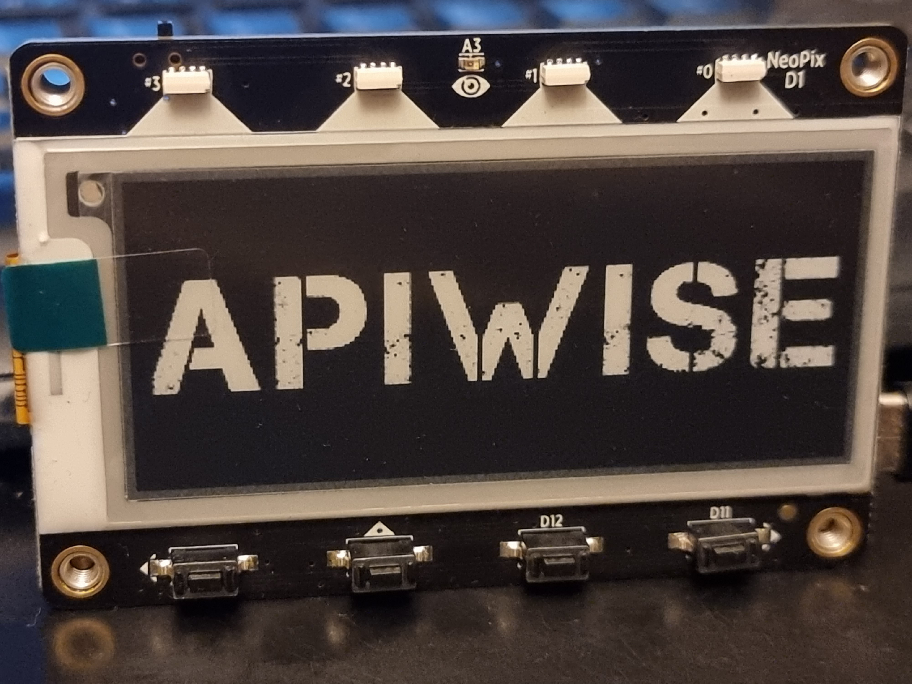
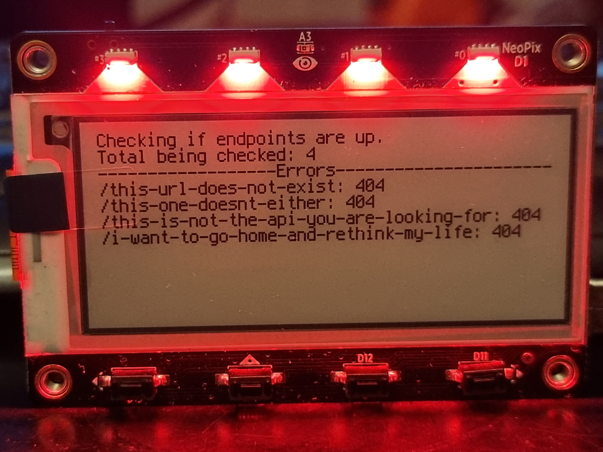
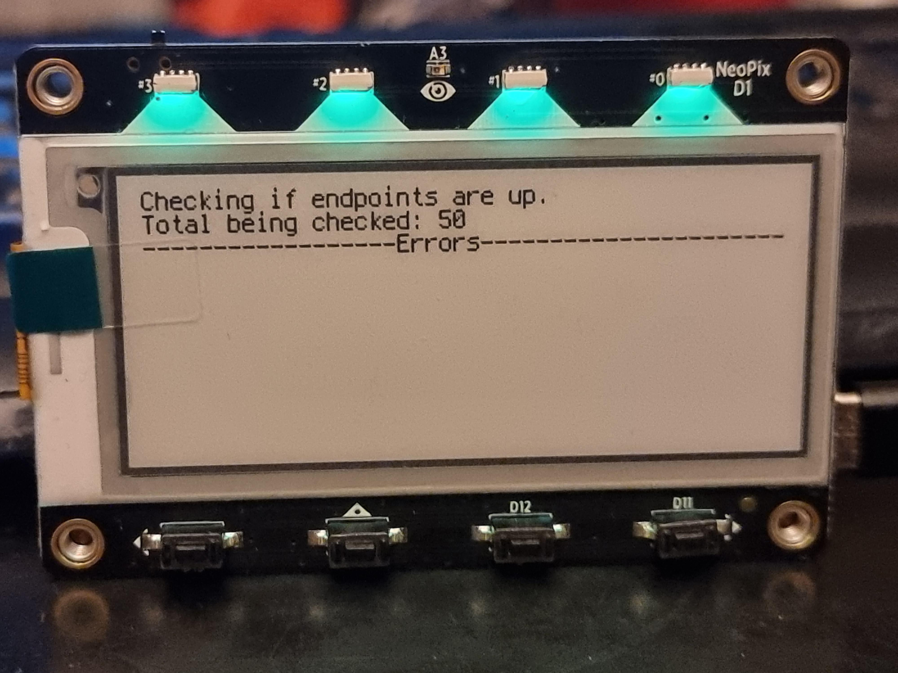
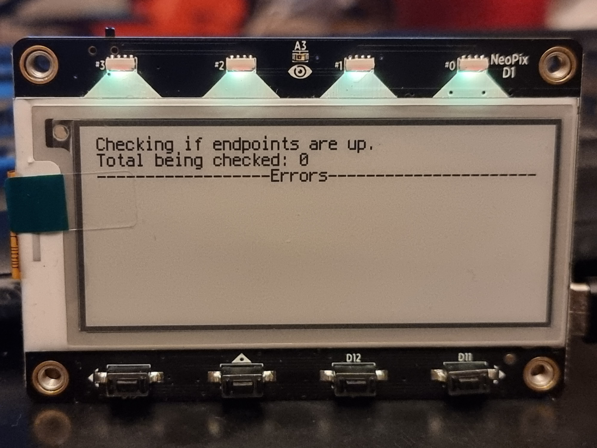

# apiwise

APIWISE is an IoT device that connects to the internet though WiFi and monitors APIs via status codes. If an endpoint returns a number greater than 399 it plays an error sound, turns the lights red and displays the error to the screen.

Otherwise it will turns its lights green and just poll every set period and when idle turn its lights yellow.

There are certain limitations with the device at the moment. Long URLs are truncated to a max of 40 characters and pages of errors are not shown. Ideally I would use the buttons on the bottom to scroll through the errors. However if there are pages of errors, there is normally a catastrophic problem that's common to all of them.

Additionally there is a very weird problem with the MicroPython adafruit_requests library when a large response comes back and crashes the device. I am still triaging this.

All in all a fun project. I'd never used MicroPython before and it's been years since I've used Python.