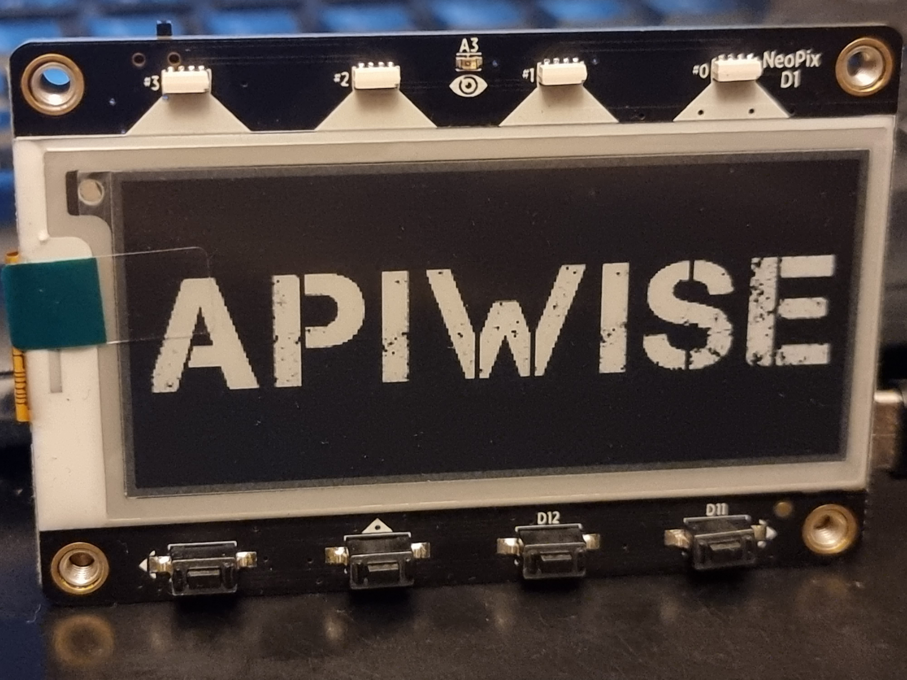
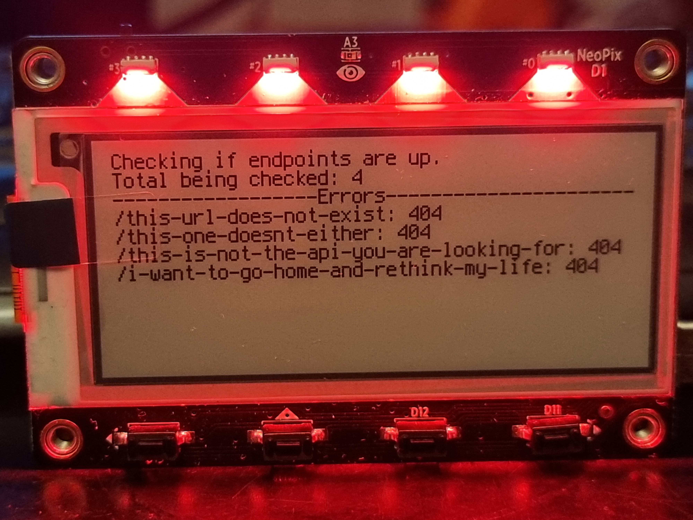
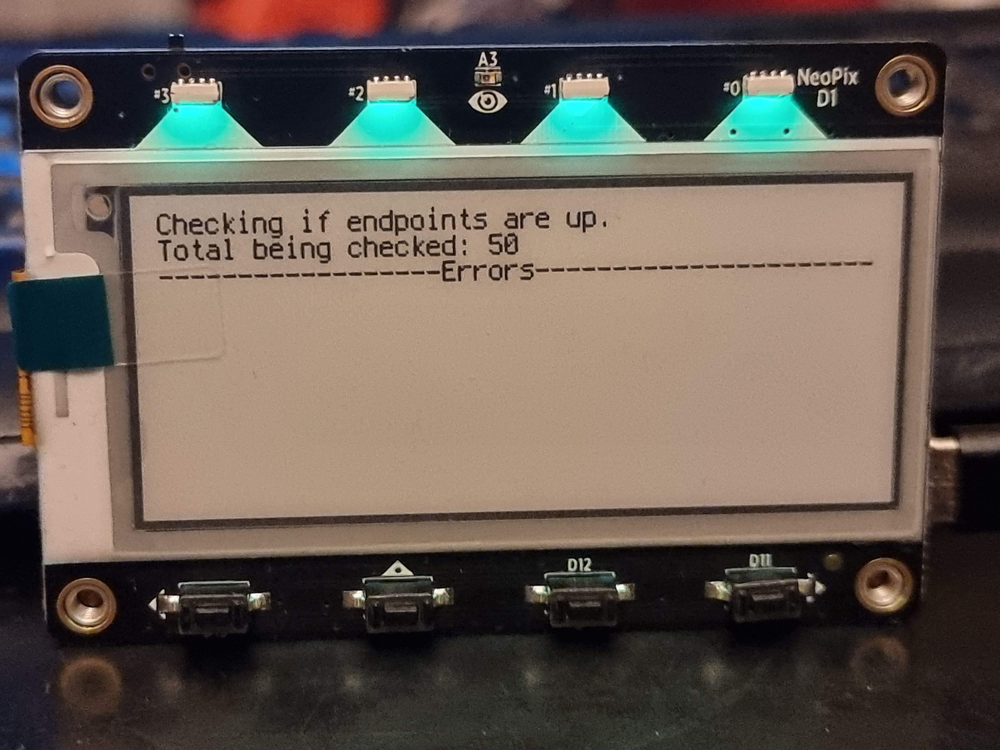
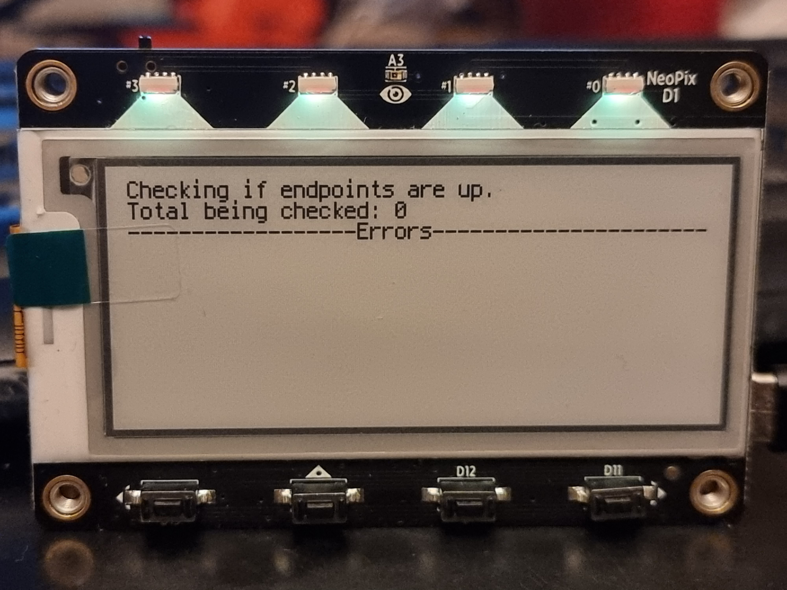

# APIWISE

<p align="center">
  
</p>

APIWISE is an <a href="https://www.adafruit.com/product/4800">Adafruit MagTag IoT device</a> that monitors API health over WiFi and provides immediate local feedback through e-ink text, NeoPixel status lights, and audio alerts.

## Problem Context

Our DevOps team owned endpoint operations and handled a broad set of platform responsibilities, so there was limited time to build a dedicated, always-visible alerting workflow for mobile API outages. To close that gap, I built APIWISE: a small device that sat next to me in my living room and gave immediate local alerts when an endpoint failed, so I could quickly investigate and address issues.

## Operational Impact

APIWISE helped me uncover endpoint errors quickly. A meaningful share of incidents were related to CMS content changes, and the device made those failures visible right away. When an alert fired, I could promptly notify the CMS team so they could re-edit or republish the relevant WordPress content and restore the endpoint.

## What This Project Demonstrates

- Embedded Python development on constrained hardware.
- External API monitoring with lightweight request logic and status classification.
- State-driven behavior design (normal polling, error mode, recovery mode).
- Hardware UX integration across screen, lights, and sound.
- Practical operational concerns: secrets handling, endpoint configuration, and failure triage.

## System Behavior

| State | Trigger | Check Interval | Device Feedback |
| --- | --- | --- | --- |
| Startup | Power on / reset | Immediate | Splash screen, WiFi connection details, endpoint count |
| Normal Monitoring | No HTTP status codes above `399` | Every `300s` | Green during checks, yellow while idle |
| Error Mode | Any endpoint returns status `>= 400` | Every `300s` | Red lights, error tone, error list on display |
| Recovery | Previously failing endpoints return `2xx/3xx` | Next scheduled check | Error state cleared, lights reset |

<p align="center">
  
</p>

<p align="center">
  
</p>
<p align="center">
  
</p>

## Architecture

The project is split into small modules with clear responsibilities:

- `code.py`: main event loop and state transitions.
- `setup.py`: display initialization, WiFi setup, and request session setup.
- `api.py`: endpoint checks and error collection.
- `display_text.py`: formatting and rendering error text to the e-ink display.
- `peripherals.py`: LED and tone behavior.
- `endpoint.py`: monitored endpoint list.
- `secrets.py` (local only): WiFi credentials and local secret values.

### Request and Alert Flow

1. Load configured endpoints from `endpoint.py`.
2. Build request URLs from `ENPOINT_BASE + endpoint`.
3. Poll each endpoint and collect responses with status `> 399`.
4. If errors exist, switch to error indicators (red LEDs + tone + on-screen list).
5. If no errors exist, return to normal monitoring indicators.

## Quickstart

### 1. Hardware

- Adafruit MagTag (ESP32-S2)
- USB cable for flashing and deploying files

### 2. Firmware and Libraries

1. Install CircuitPython on the MagTag.
2. Add required libraries from the CircuitPython bundle to `CIRCUITPY/lib`:
   - `adafruit_magtag`
   - `adafruit_requests`

### 3. Project Setup

1. Copy local secrets:

```bash
cp secrets.example.py secrets.py
```

2. Fill in `secrets.py` values:
   - `ssid`
   - `password`
3. Configure endpoints in `endpoint.py`.
4. Adjust `ENPOINT_BASE` and polling constants in `code.py` if needed.

`secrets.py` is ignored by git and should never be committed.

### 4. Deploy to Device

1. Copy project files to the `CIRCUITPY` drive.
2. Ensure image assets in `images/` and bitmaps in `bmps/` are present.
3. Reset the board and verify startup WiFi output on screen.

## Configuration Notes

- `API_CHECK_PERIOD` and `ERROR_CHECK_PERIOD` are both `300` seconds by default.
- Endpoint text is truncated to `MAX_STRING_WIDTH` (`40`) characters on the display.
- Current error rendering is bounded by available display lines.

## Roadmap

- Add button-based pagination for multiple pages of errors.
- Improve long endpoint rendering strategy (scrolling/wrapping instead of truncation only).
- Add retry/backoff and timeout behavior around network requests.
- Investigate and harden handling for large response payload crashes in `adafruit_requests`.
- Add lightweight test coverage around status classification and state transitions.
